# Mobile Robot Navigation Basics

This is a small Python practice project for mobile robot navigation basics.
It is not a complete autonomous robot system. I made it to understand some simple parts of grid map, terrain cost, A* path planning, and vehicle tracking.

The project starts from a very basic terrain grid and then slowly adds more parts. I wanted to keep the code simple, because this was mostly for learning and practice.

GitHub folder:
[mobile_robot_navigation_basics](https://github.com/mhfakouri/python-simple-examples/tree/main/robotics/mobile_robot_navigation_basics)

---

## What this project includes

The project has these small practice steps:

1. Basic NumPy terrain grid
2. Larger terrain map
3. A* path planning
4. Simple vehicle tracking
5. A* path with vehicle tracking
6. Disturbance and simple tracking metrics
7. Shortest path vs risk-aware planning

The full idea is:

```text
terrain map → terrain cost → A* path → risk-aware path → waypoints → vehicle tracking → tracking error
```

---

## Requirements

I used only simple Python libraries:

```text
numpy
matplotlib
```

Install them with:

```bash
pip install -r requirements.txt
```

---

## 01 — Basic terrain grid

In the first script, I made a small 10 by 10 grid. Each cell has a number.

```text
0 = flat terrain
1 = rough terrain
2 = risky terrain, like snow or ice
9 = obstacle
```

This was the first step to understand how a terrain map can be made with NumPy.

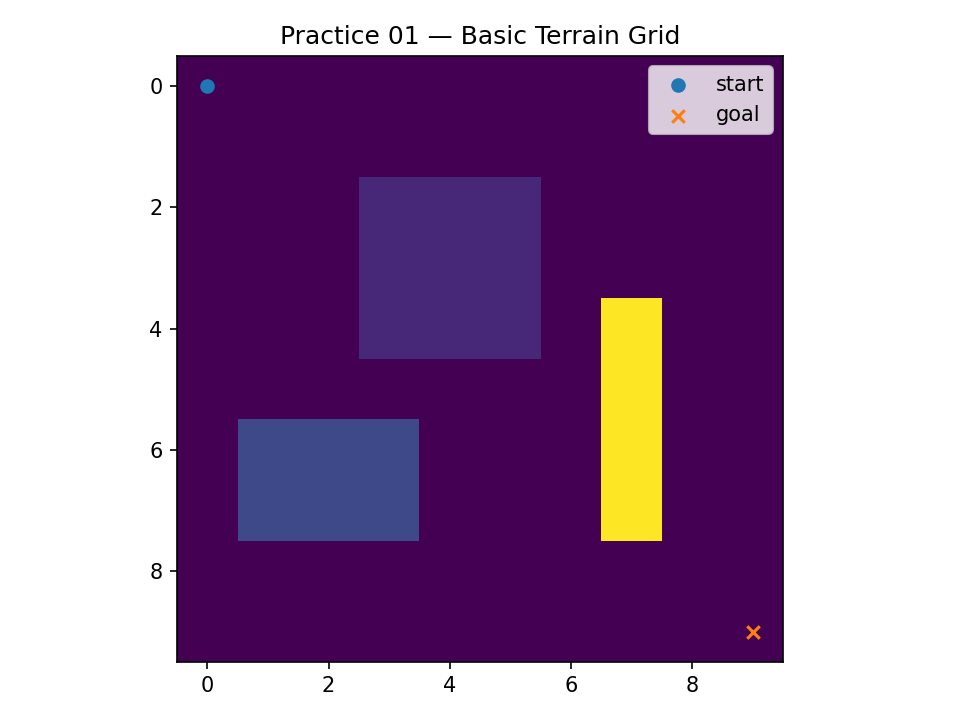

Run:

```bash
python projects/01_numpy_grid_basics/grid_basics.py
```

---

## 02 — Larger terrain map

Then I made a bigger 30 by 30 map. I added rough area, risky area, obstacle walls, and some random obstacles.

The random obstacles are not from real sensor data. I just used them to make the map not too empty. It helped me to prepare a simple environment before path planning.

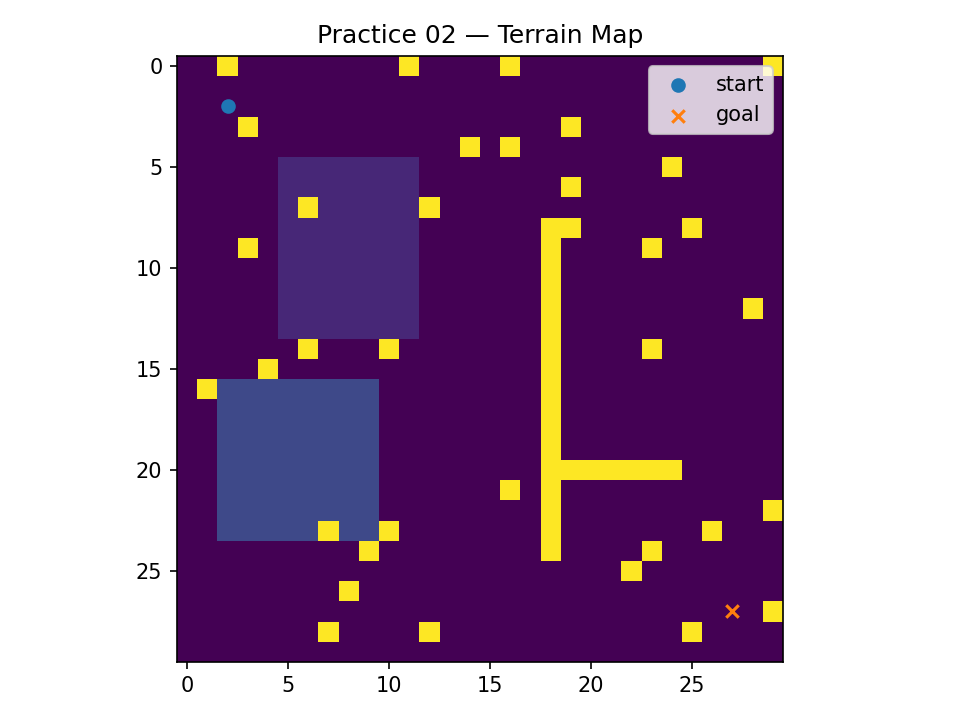

Run:

```bash
python projects/02_terrain_plotting/terrain_plot.py
```

---

## 03 — A* path planning

After making the terrain map, I added A* path planning.

The planner tries to find a path from start to goal. It avoid obstacles and also uses terrain cost. Flat terrain has low cost, rough terrain has more cost, and risky terrain has higher cost.

The blue line shows the A* path. It is not smooth because it is a grid path. It moves only up, down, left, and right.

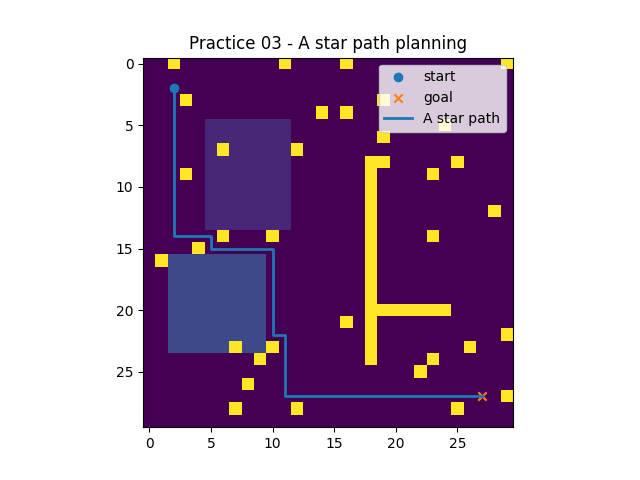

Run:

```bash
python projects/03_astar_path_planning/astar_demo.py
```

---

## 04 — Simple vehicle tracking

Before connecting A* to the vehicle, I made a small vehicle tracking example.

In this part, I wrote some waypoints manually. The vehicle follows them using a simple unicycle model with `x`, `y`, and `theta`.

The model is not very realistic. It does not include motor dynamics, slip, wheel limits, or real terrain effect. But it was useful for me to understand the basic tracking idea.

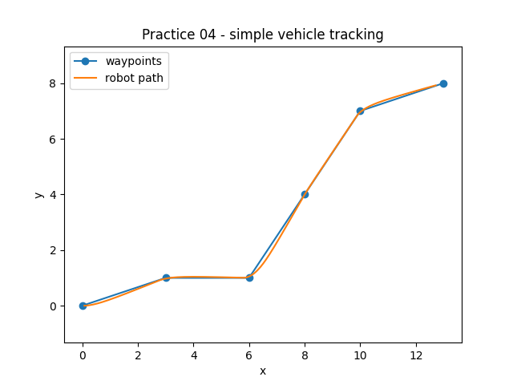

Run:

```bash
python projects/04_vehicle_tracking/vehicle_tracking.py
```

---

## 05 — A* path with vehicle tracking

In this part, I connected the A* path to the vehicle tracking.

A* gives the path as grid points in this format:

```text
row, column
```

But the vehicle model uses:

```text
x, y
```

So I converted the points like this:

```text
x = column
y = row
```

I also did not use every point from A* as a waypoint. I selected every few points, because the path has many grid cells and the simple vehicle can turn too much if all of them used.

The final plot shows the terrain map, A* path, selected waypoints, and vehicle tracking path.

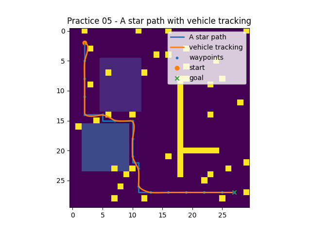

Run:

```bash
python projects/05_astar_vehicle_tracking/astar_vehicle_tracking.py
```

---

## 06 — Disturbance and simple metrics

I also added one small disturbance test.

In this version, the vehicle does not move in perfect condition. I added a small random heading noise, and I also changed the vehicle speed based on terrain type. The vehicle moves slower on rough terrain and slower again on risky terrain.

This is not a realistic winter terrain simulation. It is only a small test to see what happens when the vehicle motion is not perfect.

The script also calculates some simple metrics:

```text
A* path cells: 51
selected waypoints: 18
path cost: 51.0
rough cells in path: 0
risky cells in path: 0
mean tracking error: 1.71
max tracking error: 3.30
```

The path did not pass from rough or risky cells in this run, so both of them was zero. The vehicle finished near the goal position, but the tracking error is still visible because the model has disturbance and it is very simple.

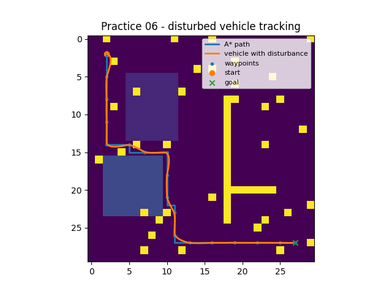

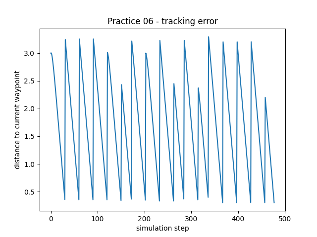

Run:

```bash
python projects/06_disturbance_and_metrics/disturbance_and_mertrics.py
```

---

## 07 — Shortest path vs risk-aware planning

After the disturbance test, I added one more comparison between two planners.

The first one is a shortest path planner. It uses A* and tries to find the route with lower distance. In this case, flat, rough, and risky cells are almost treated same, so the planner may pass from a risky area if it makes the path shorter.

The second one is a risk-aware planner. It also uses A*, but the terrain cost is different. Rough cells have more cost, and risky cells have much more cost. So the robot may choose a longer path, but with less terrain risk.

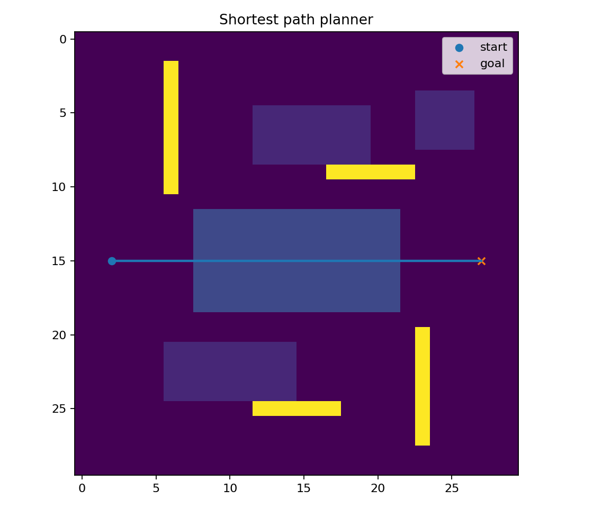

The shortest path is more direct, but it crosses the risky region in the middle of the map.

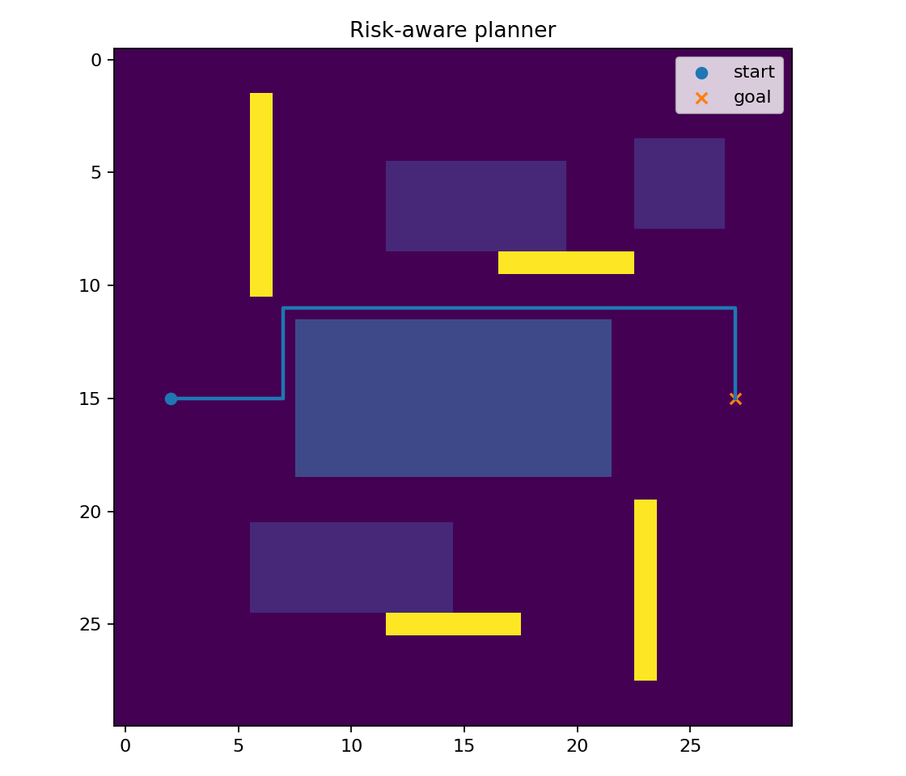

The risk-aware path is longer, but it avoid the risky cells.

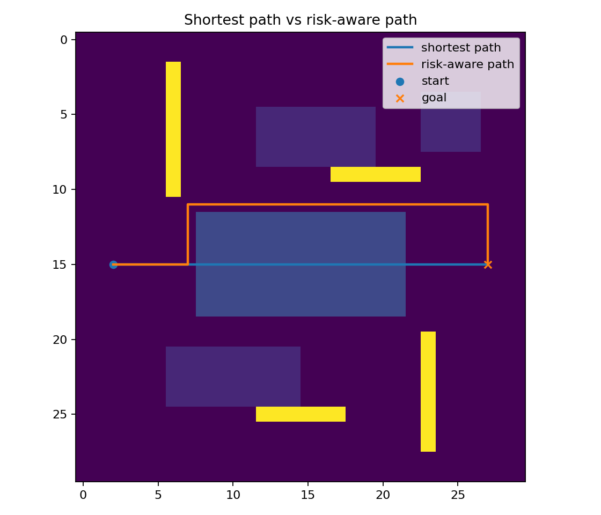

This figure is the main result of this part. It shows that the shortest path is not always the better path when the terrain is risky.

| Planner         | Path length | Total terrain cost | Risk exposure | Tracking error | Success |
| --------------- | ----------: | -----------------: | ------------: | -------------: | ------- |
| Shortest path   |          25 |              179.0 |            14 |           1.81 | Yes     |
| Risk-aware path |          33 |               33.0 |             0 |           1.71 | Yes     |

The shortest path has lower distance, but it has much higher terrain cost. It also passes through 14 risky cells. The risk-aware path has more distance, but it had zero risky cells in this test.

I think this part is useful because in rough terrain navigation, the robot should not only think about the shortest route. Sometimes a longer route can be safer or more reasonable.

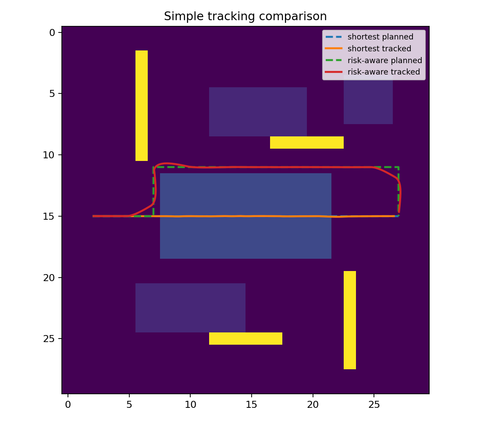

I also tested both planned paths with the same simple tracking model. This is still a very simple simulation, but it helps to compare planning and tracking together.

Run:

```bash
python projects/07_shortest_vs_risk_aware_planning/shortest_vs_risk_aware.py
```


---

## What I learned

This project helped me understand the basic connection between map, path planning, and vehicle tracking.

The main things I practiced were:

* making a grid map with NumPy,
* assigning terrain type and cost,
* using A* for simple path planning,
* avoiding obstacle cells,
* converting grid path to vehicle waypoints,
* tracking waypoints with a simple vehicle model,
* adding small disturbance,
* calculating simple tracking error.

This project is still basic. There is no ROS, no real robot, no camera, no LiDAR, and no advanced controller. The map is manually created and the terrain costs are also manually selected.

But it was useful for me, because it made the relation between terrain representation, planning, and tracking more clear.
